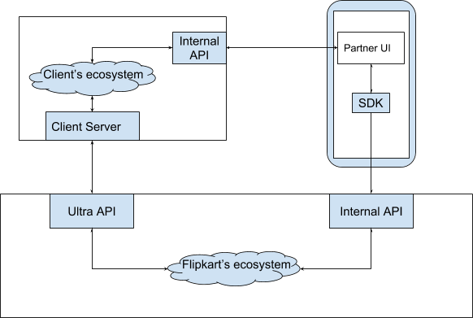

# Integration with Ultra

This section will guide you while you are integrating your application with Ultra. If you want to have a visual walk-through before following the detailed instructions, please head over to our [Ultra Demo](demo.md) segment. You can open the Ultra playground application on your browser there and learn about implementation of the APIs.

Before we move on to the steps of integration, we want you to understand the high-level picture of the data-flow between different systems. The user’s data will flow to the partner’s end through Ultra. At user’s side, the internal APIs will interact with the partner’s UI within Ultra container and the user’s information such as login details will pass through the Flipkart’s ecosystem to the partner’s side with the help of the Ultra APIs. At partner’s side, the application will interact with the internal APIs of Flipkart and Ultra to gain user data and open access to their application. Following is the diagrammatic representation of this high level scenario:

 &nbsp;&nbsp;&nbsp;&nbsp;&nbsp;&nbsp;&nbsp;
**_High-level representation of user’s data flow between systems_**

Now, we will show you the steps to follow on how to integrate your application with Ultra platform. If you face any issues or queries while performing integration, please reach out to [us](contact.md).

## Step 1: Choose your UI platform

You can build your application on Ultra using either [React Native](https://facebook.github.io/react-native/) platform or simple HTML /PWA. Ultra supports both containers and we can help you in making this choice by spotlighting a comparison between these two platforms as below:

| **React Native** | **HTML** |
|--------------|------|
| Supports JavaScript code | Supports JavaScript code |
| Extraordinary performance | Satisfactory performance |
| Highly optimised for mobile applications | Average optimisation |
| Bundle is delivered from Flipkart CDN, only differential components are downloaded and is cached within the Flipkart application | Bundle and assets follow cache-control headers and might be slower to render even from cache |

### Ultra’s interaction with UI platform

#### Using React Native

If you choose React Native, Ultra will pull in your React Native bundle from your GitHub repository and then deliver to Flipkart application over-the-air. Flipkart receives these React Native JavaScript bundles via Dynamic Update Service ([DUS](https://github.com/Flipkart/DUS)). We recommend you to visit [this link](https://github.com/Flipkart/DUS) to understand how this works.

Once DUS fetches your bundle within the Flipkart application, it will load your React Native experience within a React Fragment from where you can navigate to the other pages.

> This approach helps you in composing mobile applications faster having a rich UI and by using only Java scripts. You need to pick your fundamental UI building blocks and merge them simultaneously using JavaScript and React to produce a real mobile application but, limit the usage of the native bridges within Flipkart area only. Since one cannot deliver the local assets such as images/videos over-the-air as JavaScript, upload these assets to your CDN and reference them within the JavaScript code.

#### Using HTML

If you build your application via HTML/PWA, Ultra will launch the webpage inside android’s web-view. You can pick your existing mobile website and reuse it for Ultra after making minor changes. 

> This approach will help you in building a good mobile application but it will not appear as realistic and responsive as the one developed using React Native.

!!!note
    Both the approaches will not allow you to navigate away from your main domain. Suppose your application is hosted on some domain for e.g. “ABC.com” and it has hyperlink somewhere that navigates user to “ABC.org”. In such case, the site will not work and throw a “Security Error” message. Please contact us if you face any such issue in your application as we have got a way for bypassing this limitation by whitelisting the domains you own.

## Step 2: Integrate Ultra JavaScript SDK
After you have decided on which UI platform to opt, include Ultra’s JavaScript SDK into your application (either React Native or HTML/PWA). This SDK will help you build applications that run within the Flipkart application and give access to the Ultra specific bridge methods required for authorizations (Oauth), logins and payments.

!!!note
    The logic presented here works in both React Native and HTML/PWA. These methods are asynchronous and always return a promise that gets resolved with some values. An exception to these methods are fire and forget calls where you may not care about the response.

Next, [add the dependency](clients.md#step-1) for the SDK. Please [contact us](contact.md) for generating your client parameters i.e. clientID and secret so you can access the Ultra APIs.

After adding the dependency, you need to [initialize the SDK](clients.md#step-2) with your clientID parameter (shared by [us](contact.md)).

## Step 3: Ultra User Login Process
In this section, you learn how to fetch user details securely from Flipkart’s domain. A user can gain entry into your application only after allowing permissions to share their information (such as name, email, phone number etc.). This step guides you about the generation of grant token, fetching user’s information and login the user into your application.
Generate grant token
You might have come across the terms which are very common in the technical world of authorization (OAuth) world such as `Granted Scopes` and `Grant tokens`. To know more, [read this](https://alexbilbie.com/guide-to-oauth-2-grants/).

Before fetching any data of the user, call the [`getToken()`](clients.md#permissions-module) method and supply the list of parameters that includes the list of user resources you want to gather i.e. user’s name, email, phone number etc. After you call this method, it renders an `Allow/Deny permissions` prompt to the user as shown below:
 &nbsp;&nbsp;&nbsp;&nbsp;&nbsp;&nbsp;&nbsp;
**_Allow/Deny permissions prompt_**

!!!note
    This permission popup has a special behavior when a single scope is requested and user has some unverified pre-filled value. For example, if you have asked permission for a user.email scope and the user has a unverified email address in Flipkart, it automatically initiates the email verification for the user. This helps user in avoiding any extra clicks.

Following use case diagram illustrates the entire scope selection process:

**_Scope selection legend_**
| **Legend**          | **Description**             |
|---------------------------|----------------------|
| Partner UI                | Partner’s application UI which gets rendered within Flipkart app           |
| SDK       | JavaScript client SDK that exposes Ultra’s APIs   |
| Partner Server | Partner’s backend server |
| Ultra API | Public API which is exposed by Ultra i.e. platform.flipkart.net |

We suggest to use flags like `isMandatory` and `shouldVerify` to control whether you want these permissions to be mandatory. Like here, `isMandatory` is a boolean type variable that you enable if you want the scope to be mandatory and must be filled by the user. `shouldVerify` is also a boolean type variable that you enable if you want that the same scope to be verified as well. Suppose, your `getToken()` call is `getToken(['scope':'user.email', 'isMandatory':true, 'shouldVerify':true])`. It means that user is not allowed to grant permissions without entering the email address as well as verifying it. 

!!!note
    You should set both `isMandatory` and `shouldVerify` to true only when you absolutely require the user’s verified email address because you may observe that if such constraints are imposed on users, there occurs a significant drop in the number of users who grant permissions.
    Since most of the phone numbers of Flipkart users are OTP verified, there would be no requirement of such verification within this flow. But if there are any users who are not already OTP verified, a prompt for the OTP verification process appears to them before the control comes back to you.
    Once the user has allowed the permissions, a [`promise`](https://javascript.info/promise-basics) is returned which contains the information about the token that is resolved.

The `getToken()` method returns a list of both allowed as well as rejected permissions that depend upon the user’s response to the `Allow/Deny permissions` prompt. It also returns an access token that has to be passed to your server so that it can hit the Flipkart’s API to read the user’s actual information. This information has to be read from one server by another server only using the provided `grantToken` so that it remains protected and secured.

***If user dismiss/deny permissions:***
When user has dismissed the permissions prompt, [`promise`](https://javascript.info/promise-basics) fails and enters into the catch block. This `promise` can also fail if the SDK network calls have failed. 

If user denies the permissions, `promise` is resolved successfully and you receive a `grantToken`. It is because there might be partial denials from the user i.e. when the user denies the permission to grant the phone number but accepts to grant the email address. Hence, with respect to the token generation point of view, each acceptance and denial is treated as a success. Check `NativeModuleResponse.result` attribute to view the list of accepted and rejected permissions.

!!!note
    An ideal way of handling denials from the user is to show a page that explains why these permissions are mandatory. To know more, refer [Android's user guide](https://developer.android.com/topic/performance/vitals/permissions).

After `promise` has failed, catch block function is invoked with an object that has `message` and `code`. For checking a list of possible errors, [click here](#handling-errors).

### Get user’s information
In order to fetch user’s information, send the `grantToken` to your server either by using an AJAX call or any other mechanism that you prefer. This token is further used by your server to get an access token by making a call to `/1/authorization/auth` [(see how)](backend.md#access-token-flow). Then, use this access token to fetch user resources such as `user.email`, `user.mobile` [(check here)](backend.md#resource-fetching-flow). Following use case diagram illustrates this process:

!!!note
    Since the APIs to fetch user’s information are available on client side as well (being REST APIs), we highly recommend you to always fetch the user’s data on server side to avoid security threats like MITM attacks.

### User’s login into the application
Since the user is already logged into the Flipkart, it is not a good idea to ask user to re-login with the name and email address for entering into the external application. So, Ultra encourages automatic login to the application with user’s consent. This is achieved by using the value of `mobileNumber` parameter in combination with `isVerified` flag.

!!!note
    We suggest you to set a cookie that prevents repeated calls to the “getToken()”(link) method each time user enters into your app through Ultra.
    Also, we highly recommend to set this towards the end of the user funnel to avoid the dropouts.

This completes the login flow, user is now free to explore your app facilities.
