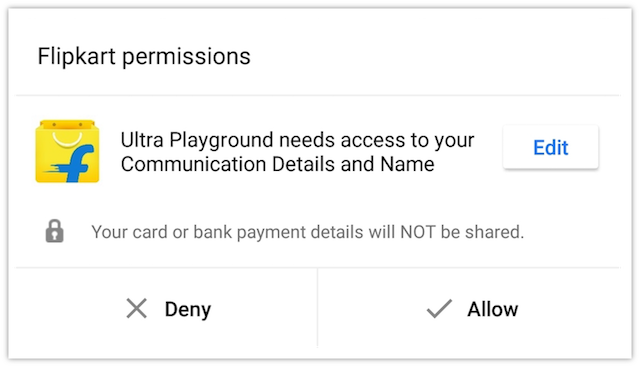
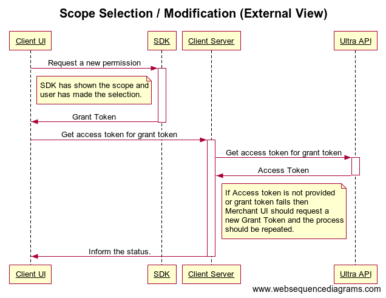
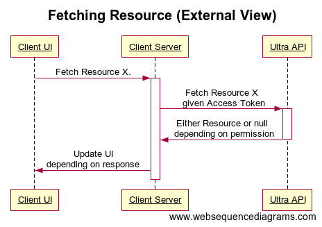
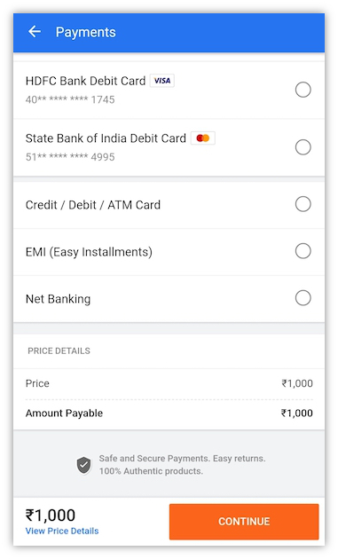
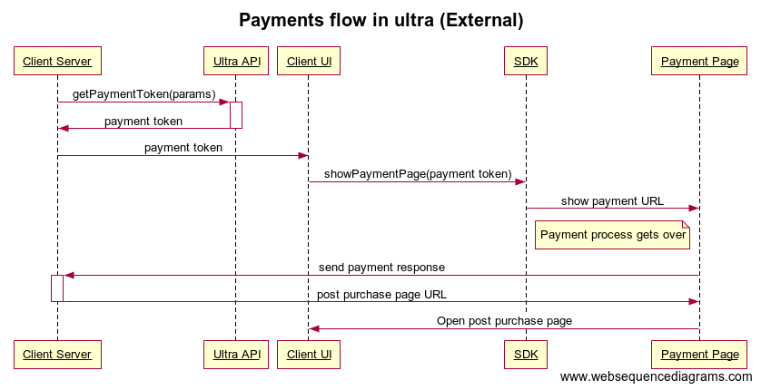
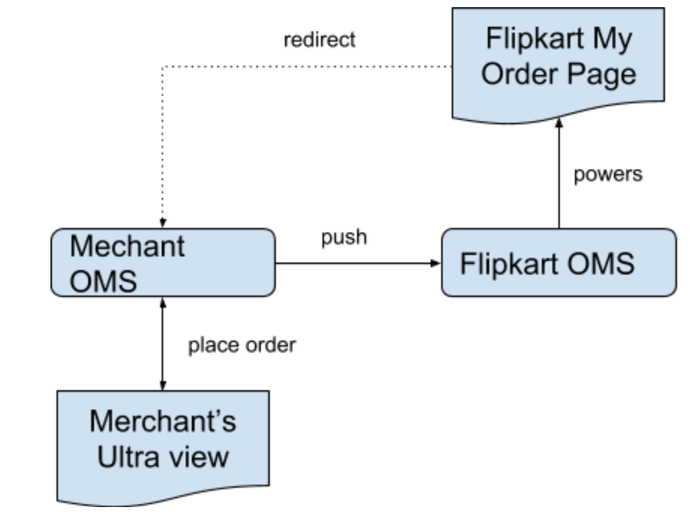

# Integration with Ultra
---
# Steps

These steps act as a comprehensive guide for integrating your service using Ultra platform. If you wish to have a visual walk-through before following the detailed instructions, check [here](demo.md). For any issues or queries encountered anytime during this process, please reach out to [us](contact.md).

## 1: Choose your UI platform

Ultra supports [React Native](https://facebook.github.io/react-native/) as well as a simple HTML /PWA. You can build your application using either of these and we can help you in making the best choice by spotlighting a comparison between the two as follows:

| **React Native** | **HTML** |
|--------------|------|
| Supports JavaScript code | Supports JavaScript code |
| Extraordinary performance | Satisfactory performance |
| Highly optimised for mobile applications | Average optimisation |
| Bundle is delivered from Flipkart CDN, only differential components are downloaded and is cached | Bundle and assets follow cache-control headers and might be slower to render even from cache |

### Ultra’s interaction with UI platform

#### Using React Native

Ultra pulls in the React Native bundles from your GitHub repository and then delivers it to Flipkart dynamically which we prefer to call as `Over-The-Air`. Flipkart receives these React Native JavaScript bundles via `Dynamic Update Service (DUS)`. We recommend you to visit [this link](https://github.com/Flipkart/DUS) to understand how DUS works.

Once DUS fetches your bundle within the Flipkart, it loads the React Native application within a React Fragment from where you can navigate to the other pages.

> This approach helps you in composing mobile applications quick, having a rich UI and by using only JavaScripts. You are free to pick your fundamental UI building blocks and merge them simultaneously using JavaScript and React to produce a real mobile application. But, limit the usage of the native bridges within Flipkart area only. Since one cannot deliver the local assets such as images/videos dynamically like JavaScript, you have to upload these assets to your CDN separately and reference them within the JavaScript code.

#### Using HTML

Ultra launches the webpage inside a mobile’s web-view. Here, you may pick your existing mobile website and mould it for Ultra after few tweaks. 

> This approach helps you in building a decent mobile application but it does not appear as realistic and responsive as the one developed using React Native.

!!!note
    One important point to keep in mind is that both the approaches do not allow you to navigate away from your main domain. Let us suppose your application is hosted on some domain for example, `ABC.com` and the site contains a hyperlink that navigates control to some other domain say, `ABC.org`. In such case, the site does not work and throws a `Security Error` message. If you have a similar situation in your application, please contact [us](contact.md) as we have got a way for bypassing this limitation by whitelisting the domains you own.

## 2: Integrate Ultra JavaScript SDK
After you have made up your mind on which UI platform to work with (either React Native or HTML/PWA), include Ultra’s JavaScript SDK into your application. This SDK helps you build applications that run within Flipkart app and give access to the Ultra’s JavaScript methods required for logins, authorizations (OAuth) and payments.

Next, [add the dependency](clients.md#step-1) for the SDK. [Contact us](contact.md) for generating the parameters specific to your application i.e. clientID and secret to access the Ultra APIs.

After adding the dependency, [initialize the SDK](clients.md#step-2) using the above parameters.

!!!note
    The logic presented here works in both React Native and HTML/PWA. These methods are asynchronous and always return a [promise](https://javascript.info/promise-basics) that gets resolved with some values except few other JavaScript methods that have no return value.

## 3: Ultra User Login Process
In this section, you learn how to fetch user details securely from Flipkart’s domain. A user can gain entry into your application only after allowing permissions to share their information (such as name, email, phone number etc.). This step guides you about the generation of grant token, fetching user’s information and login the user into your application.

### Generate grant token
You might have come across the terms which are very common in the technical world of authorization (OAuth) such as `Granted Scopes` and `Grant tokens`. To know more, [read this](https://alexbilbie.com/guide-to-oauth-2-grants/).

Before fetching any data of the user, call the [`getToken()`](clients.md#permissions-module) method and supply the list of parameters that includes the list of user resources you want to gather i.e. user’s name, email, phone number etc. After you call this method, it renders an `Allow/Deny permissions` prompt to the user as shown below:
 &nbsp;&nbsp;&nbsp;&nbsp;&nbsp;&nbsp;&nbsp;&nbsp;&nbsp;&nbsp;&nbsp;&nbsp;&nbsp;&nbsp;
&nbsp;&nbsp;&nbsp;&nbsp;&nbsp;&nbsp;&nbsp;&nbsp;&nbsp;&nbsp;&nbsp;&nbsp;&nbsp;&nbsp;&nbsp;&nbsp;&nbsp;&nbsp;
**_Allow/Deny permissions prompt_**

!!!note
    This permission popup has a special behavior when a single scope is requested and user has some unverified pre-filled value. For example, if you have asked permission for a user.email scope and the user has a unverified email address in Flipkart, it automatically initiates the email verification for the user. This helps user in avoiding any extra clicks.

Following sequence diagram illustrates the entire scope selection process:

| **Legend**          | **Description**             |
|---------------------------|----------------------|
| Partner UI                | Partner’s application UI which gets rendered within Flipkart app           |
| SDK       | JavaScript client SDK that exposes Ultra’s APIs   |
| Partner Server | Partner’s backend server |
| Ultra API | Public API which is exposed by Ultra i.e. platform.flipkart.net |

We suggest to use flags like `isMandatory` and `shouldVerify` to control whether you want these permissions to be mandatory. Like here, `isMandatory` is a boolean type variable that you enable if you want the scope to be mandatory and must be filled by the user. `shouldVerify` is also a boolean type variable that you enable if you want that the same scope to be verified as well. Suppose, your `getToken()` call is `getToken(['scope':'user.email', 'isMandatory':true, 'shouldVerify':true])`. It means that user is not allowed to grant permissions without entering the email address as well as verifying it. 

!!!note
    You should set both `isMandatory` and `shouldVerify` to true only when you absolutely require the user’s verified email address because you may observe that if such constraints are imposed on users, there occurs a significant drop in the number of users who grant permissions.
    Since most of the phone numbers of Flipkart users are OTP verified, there would be no requirement of such verification within this flow. But if there are any users who are not already OTP verified, a prompt for the OTP verification process appears to them before the control comes back to you.
    Once the user has allowed the permissions, a [`promise`](https://javascript.info/promise-basics) is returned which contains the information about the token that is resolved.

The `getToken()` method returns a list of both allowed as well as rejected permissions that depend upon the user’s response to the `Allow/Deny permissions` prompt. It also returns an access token that has to be passed to your server so that it can hit the Flipkart’s API to read the user’s actual information. This information has to be read from one server by another server only using the provided `grantToken` so that it remains protected and secured.

***If user dismiss/deny permissions:***
When user has dismissed the permissions prompt, [`promise`](https://javascript.info/promise-basics) fails and enters into the catch block. This `promise` can also fail if the SDK network calls have failed. 

If user denies the permissions, `promise` is resolved successfully and you receive a `grantToken`. It is because there might be partial denials from the user i.e. when the user denies the permission to grant the phone number but accepts to grant the email address. Hence, with respect to the token generation point of view, each acceptance and denial is treated as a success. Check `NativeModuleResponse.result` attribute to view the list of accepted and rejected permissions.

!!!note
    An ideal way of handling denials from the user is to show a page that explains why these permissions are mandatory. To know more, refer [Android's user guide](https://developer.android.com/topic/performance/vitals/permissions).

After `promise` has failed, catch block function is invoked with an object that has `message` and `code`. For checking a list of possible errors, [click here](#handling-errors).

### Get user’s information
In order to fetch user’s information, send the `grantToken` to your server either by using an AJAX call or any other mechanism that you prefer. This token is further used by your server to get an access token by making a call to `/1/authorization/auth` [(see how)](backend.md#access-token-flow). Then, use this access token to fetch user resources such as `user.email`, `user.mobile` [(check here)](backend.md#resource-fetching-flow). Following sequence diagram illustrates this process:

!!!note
    Since the APIs to fetch user’s information are available on client side as well (being REST APIs), we highly recommend you to always fetch the user’s data on server side to avoid security threats like MITM attacks.

### User’s login into the application
Since the user is already logged into the Flipkart, it is not a good idea to ask user to re-login with the name and email address for entering into the external application. So, Ultra encourages automatic login to the application with user’s consent. This is achieved by using the value of `mobileNumber` parameter in combination with `isVerified` flag.

!!!note
    We suggest you to set a cookie that prevents repeated calls to the “getToken()”(link) method each time user enters into your app through Ultra.
    Also, we highly recommend to set this towards the end of the user funnel to avoid the dropouts.

This completes the login flow, user is now free to explore your app facilities.

## 4: Payment
Now comes the point where integration of your application happens with the Flipkart payment gateway (FKPG) APIs for issuing payments and refunds. For this, [contact us](contact.md) to receive the merchant credentials required to access the API. These merchant credentials vary from the parameters used for the Ultra APIs i.e. `clientId` and `secret`.

The first step is to generate a [`payment token`](backend.md#payment-token) on the server side. This payment token has to be used to show the FKPG payment options screen via Ultra’s client SDK. This FKPG screen opens outside the Ultra’s container. Then, the next step is to start payment which opens the below screen for the user:

After the payment is successful, redirect the user to your application’s order confirmation page within the container where a `POST` call leads to the `successfulCallBackUrl` specified [here](backend.md#payment-token). Check the FORM data payload details [here](backend.md#Callback-after-PGResponse). Then, issue an HTTP redirection request to the `fapp://` [redirect URL](clients#start-payment) so that the application control goes back to the Ultra container and the order confirmation page opens within this container in the similar format.

The entire payment flow from initiation of payment to the order confirmation page is explained in the following sequence diagram:

!!!note
    It is mandatory to redirect via `fapp://` to the Ultra container.
    You should not open any UI page of your application outside Ultra container.

> Your money is transferred to an MID account which has to be configured. [Contact our team](contact.md) to onboard your MID account with us before starting the integration since it takes a significant amount of time.

In case of refunds, integrate our [refund API](backend.md#refund) with your application as per your business needs.

## 5: OMS Integration
After the order has been placed and the payment has been successfully completed, the user would want to know the status of the placed order. So, now it is the time to call the [`Flipkart OMS APIs`](oms.md) to update status of the order in your application. 

The full form of `OMS` is `Order Management System`. This system handles the activities post the order is placed. Its main job is to power the `My Orders` page on Flipkart. `OMS lite` is the name of the view layer maintained by Flipkart for the orders placed on Ultra. This layer acts as a data source for `My Orders` history and our customer executive agents. Following diagram illustrates the purpose of OMS lite:

When you come to know that the order has been placed by the user, call [this API](oms.md) to inform Flipkart OMS and the details that you supply gets displayed on `My Orders` screen in Flipkart app. We also use this information to power our customer service executives for offering a customer delight by resolving the customer queries and calls in a more meaningful way.

> The OMS integration is a mandatory step to follow. Although it has no UI implications, your application cannot go live unless this data reaches our server. We also expect that you initiate a call to our OMS APIs for every change in the state of your OMS to keep everything aligned.

