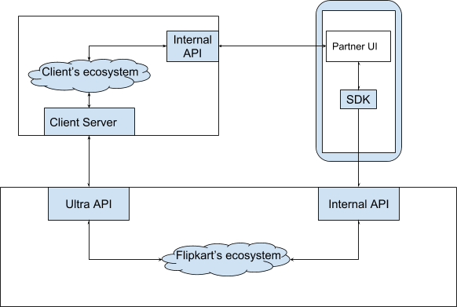

# Integration with Ultra

This section will guide you while you are integrating your application with Ultra. If you want to have a visual walk-through before following the detailed instructions, please head over to our [Ultra Demo](demo.md) segment. You can open the Ultra playground application on your browser there and learn about implementation of the APIs.

Before we move on to the steps of integration, we want you to understand the high-level picture of the data-flow between different systems. The user’s data will flow to the partner’s end through Ultra. At user’s side, the internal APIs will interact with the partner’s UI within Ultra container and the user’s information such as login details will pass through the Flipkart’s ecosystem to the partner’s side with the help of the Ultra APIs. At partner’s side, the application will interact with the internal APIs of Flipkart and Ultra to gain user data and open access to their application. Following is the diagrammatic representation of this high level scenario:

 &nbsp;&nbsp;&nbsp;&nbsp;&nbsp;&nbsp;&nbsp;
**_High-level representation of user’s data flow between systems_**

Now, we will show you the steps to follow on how to integrate your application with Ultra platform. If you face any issues or queries while performing integration, please reach out to [us](contact.md).

## Step 1: Choose your UI platform

You can build your application on Ultra using either [React Native](https://facebook.github.io/react-native/) platform or simple HTML /PWA. Ultra supports both containers and we can help you in making this choice by spotlighting a comparison between these two platforms as below:

| **React Native** | **HTML** |
|--------------|------|
| Supports JavaScript code | Supports JavaScript code |
| Extraordinary performance | Satisfactory performance |
| Highly optimised for mobile applications | Average optimisation |
| Bundle is delivered from Flipkart CDN, only differential components are downloaded and is cached within the Flipkart application | Bundle and assets follow cache-control headers and might be slower to render even from cache |

### Ultra’s interaction with UI platform

#### Using React Native

If you choose React Native, Ultra will pull in your React Native bundle from your GitHub repository and then deliver to Flipkart application over-the-air. Flipkart receives these React Native JavaScript bundles via Dynamic Update Service ([DUS](https://github.com/Flipkart/DUS)). We recommend you to visit [this link](https://github.com/Flipkart/DUS) to understand how this works.

Once DUS fetches your bundle within the Flipkart application, it will load your React Native experience within a React Fragment from where you can navigate to the other pages.

> This approach helps you in composing mobile applications faster having a rich UI and by using only Java scripts. You need to pick your fundamental UI building blocks and merge them simultaneously using JavaScript and React to produce a real mobile application but, limit the usage of the native bridges within Flipkart area only. Since one cannot deliver the local assets such as images/videos over-the-air as JavaScript, upload these assets to your CDN and reference them within the JavaScript code.

#### Using HTML

If you build your application via HTML/PWA, Ultra will launch the webpage inside android’s web-view. You can pick your existing mobile website and reuse it for Ultra after making minor changes. 

> This approach will help you in building a good mobile application but it will not appear as realistic and responsive as the one developed using React Native.

!!!note Both the approaches will not allow you to navigate away from your main domain. Suppose your application is hosted on some domain for e.g. “ABC.com” and it has hyperlink somewhere that navigates user to “ABC.org”. In such case, the site will not work and throw a “Security Error” message. Please contact us if you face any such issue in your application as we have got a way for bypassing this limitation by whitelisting the domains you own.

## Step 2: Integrate Ultra JavaScript SDK
After you have decided on which UI platform to opt, include Ultra’s JavaScript SDK into your application (either React Native or HTML/PWA). This SDK will help you build applications that run within the Flipkart application and give access to the Ultra specific bridge methods required for authorizations (Oauth), logins and payments.

!!!note The logic presented here works in both React Native and HTML/PWA. These methods are asynchronous and always return a promise that gets resolved with some values. An exception to these methods are fire and forget calls where you may not care about the response.

Next, [add the dependency](clients.md#step-1) for the SDK. Please [contact us](contact.md) for generating your client parameters i.e. clientID and secret so you can access the Ultra APIs.

After adding the dependency, you need to [initialize the SDK](clients.md#step-2) with your clientID parameter (shared by [us](contact.md)).

