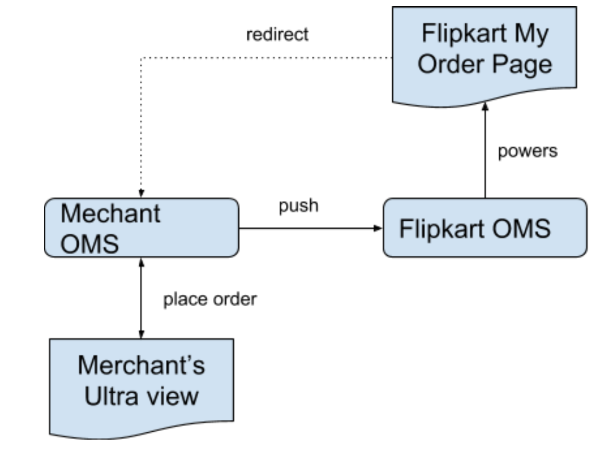

##Purpose
OMS lite is a view layer maintained by flipkart for orders placed on ultra platform. The OMS lite layer will act as a data source for flipkart’s my order page as well as CX agents.

The following diagram should explain the high level purpose of OMS lite.

##Merchant Expectation
Merchant is expected to push for every state change in their OMS.

##Schema
###Order
|name|type|mandatory|notes|
|---|---|---|---|
|orderId|string|yes|orderId is expected to be reference to merchant's OMS entry|
|description|string|yes||
|identityToken|string|yes|This identifies the user|
|orderTimestamp|long|yes|The time when order was initialised|
|orderUpdatedTimestamp|long|yes|The time when order was last modified|
|orderUrl|string|yes|The url that will take us to this specific order.|
|items|List of Item|yes|List of items which are a part of this order|
|forwardTransactions|List of ForwardTransaction|no|These can be empty only if all items are in init state|
|reverseTransactions|List of ReverseTransaction|no|Populate only if money has been reversed to customer|
|merchantAdjustments|List of MerchantAdjustment|no|All the discounts that have been offered by merchant. Base price of items - Merchant adjustments is what was passed to PG for payment from customer|
|flipkartAdjustments|List of FlipkartAdjustment|no|After response from PG, Merchants will know about additional discounts applied by PG. They should be mentioned here|
|cancellationCharges|List of CancellationCharges|no|Merchant can levy charges for cancellation, they have to be mentioned here|

###Item
name|type|mandatory|notes|
|---|---|---|---|
|itemId|string|yes|item identifier. Can be used to take customer to product from order page|
|title|string|yes|Description of item. This will be visible to customer|
|image|string|yes|Item's image|
|basePrice|double|yes|price of an item before any adjustments were applied|
|finalPrice|double|yes|price of an item after both merchantAdjustments and flipkartAdjustments have been applied. This can be null if state is INIT|
|category|string|yes|Which category does the item belong to. The category will be provided by flipkart. Please do not put your own values here|
|fulfillmentDate|long|yes|Date when the item will be fulfilled(delivery date, travel date, etc)|
|itemState|enum('INIT' or 'SUCCESSFUL' or 'CANCELLED' or 'PENDING')|yes|INIT: To be used when customer has not yet paid.  PENDING: Payment successful however merchant yet to confirm the order.  SUCCESSFUL: Atleast some part of item is confirmed. Partial cancellation will also be a part of this state.  CANCELLED: The entire item is cancelled. In this case the entire final price should either reflect in reverse transaction or cancellationCharges
|brand|string|yes|Provider/Manufacturer of product|
|product|string|yes|Description of product. For some scenarios can be similar to title (Eg: E-commerce product), so other scenarios can provide specific details like Flight number, Recharge type, etc.|
|customerName|string|yes|Name of the person for which item is intended|
|quantity|integer|yes|How many products are clubbed in this order. In case of travel this would be number of passengers. If a business does not have multiple items, they can send 1|

###ForwardTransaction
name|type|mandatory|notes|
|---|---|---|---|
|transactionId|string|yes|The transactionId shared by PG|
|amount|double|yes|Final amount deducted from customer|
|description|string|yes||
|timestamp|long|yes|Time of transaction|

###ReverseTransaction
name|type|mandatory|notes|
|---|---|---|---|
|forwardTransactionId|string|yes|The forward transaction used to take money from customer|
|reverseTransactionId|string|yes||
|amount|long|yes|amount to be refunded|
|description|string|yes||
|timestamp|long|yes|Time of transaction|

###MerchantAdjustment
name|type|mandatory|notes|
|---|---|---|---|
|adjustmentId|string|yes|Identifier for the adjustment on merchant side|
|amount|double|yes|Adjustment amount|
|title|string|yes|Adjustment Description. This could be visible to customer|

###FlipkartAdjustment
name|type|mandatory|notes|
|---|---|---|---|
|adjustmentId|string|yes|Identifier for the adjustment on provided by flipkart in PG response|
|amount|double|yes|Adjustment amount|

###CancellationCharges
name|type|mandatory|notes|
|---|---|---|---|
|itemId|string|yes|This item should be present in Items|
|reason|string|yes|This will be visible to customer|
|amount|double|yes|Cancellation amount|
