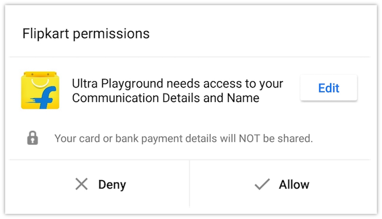
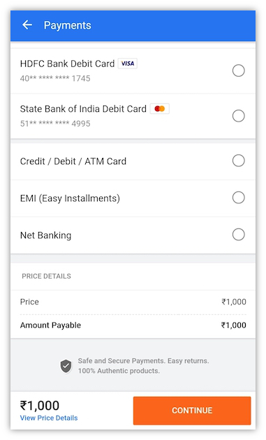

##Tutorial
This tutorial will help you integrate your service into the Ultra platform. If you dont like to read instructions and want to tinker around first, head over to the [demo](demo.md) to open the playground app. You can open it on your browser to understand how the APIs are implemented.

###Step 1 - Decide your UI platform
To start building an app on Ultra, lets first decide whether you want to build it on [React native platform](https://facebook.github.io/react-native/) or on HTML/PWA.
Ultra supports both containers. Here's a brief comparison of the platforms.

| **React native**          | **HTML**             |
|---------------------------|----------------------|
| Code in JS                | Code in JS           |
| Awesome performance       | Decent performance   |
| Very optimized for mobile | Not highly optimized |
| Bundle is delivered from FK CDN, only differential components are downloaded, and is cached within the FK app | Bundle and assets follow cache-control headers and might be slower to render even from cache | 

####*React Native*

If you choose React native, Ultra will pull in your react native bundle from your github repository, and then deliver it to Flipkart app over-the-air. React native JS bundles are delivered to Flipkart app via [DUS](https://github.com/Flipkart/DUS). We highly encourage you to visit the github page to understand how it works.

The only limitations are :

- You cannot use any other extra native bridges which are not exposed by Flipkart. 

- You cannot use local assets like images/videos within the bundle since only JS is delivered over-the-air. All assets have to be uploaded to your CDN manually and referenced within the JS code.

Once DUS fetches your bundle within the Flipkart app, your react native experience will be loaded within a React Fragment and from there on you can navigate to other pages accordingly.

####*Webview*

If you choose to build via HTML/PWA, then ultra will launch your webpage inside Android's webview. If you have your existing mobile website, you can choose to reuse it for Ultra, by only choosing to make small changes. The only catch is that you are not allowed to navigate away from your main domain.

###Step 2 - Integrate JS SDK

Based on the platform you choose, you have to [add the Ultra Javascript SDK to your HTML/React-native app](clients.md#step-1). This SDK will provide access to Ultra specific bridge methods needed for Oauth/Login and Payments. Once you add the dependency for the SDK, you need to [initialize the SDK with your clientId](clients.md#step-2).

[Contact flipkart](contact.md) to generate a `clientId` and `secret` needed to access Ultra APIs. For playing around with the APIs you can use [our test credentials](demo.md#test).

Most apps require its users to enter their email address and name before proceeding. We all know that asking the user to login to your app even if he is logged in on Flipkart app is not a good idea. Hence Ultra encourages apps to automatically login the user with their consent.

In this step we will learn how to fetch user details from flipkart securely by asking the user to grant permissions to their data.

This section will also introduce you to terms which are common in the Oauth world like `Granted Scopes`  and `Grant tokens`.

The first step in fetching user data is to [call `getToken`](clients.md#permissions-module) and supply the list of user resources you like to fetch. This will render the Allow/Deny permission prompt to user, once allowed, the `Promise` which contains the `token` is resolved.

When you call `getToken` the following bottomsheet is shown to the user.

Use flags like `shouldVerify` and `isMandatory` ([details here](clients.md#permissions-module)) to control whether you want the permission mandatorily and also whether the resources like email and phone should be OTP verfied on Flipkart's end. Most phone numbers on Flipkart systems are OTP verified, so they would not need to verify their phone number within the `getToken` flow. For users who arent OTP verified, they will be shown a screen to verify their phone numbers before the control comes back to you. 

###Step 3 - Fetch user data
Send the token to you server using a AJAX call or any other mechanism you prefer. This token can be used by the server to get an access token which we will learn in the next step.

On your server side, use this grant token and fetch the access token by making a call to `/1/authorization/auth`. More details [here](backend.md#access-token-flow).
Use the access token and fetch resources like `user.email` and `user.mobile`. More details [here](backend.md#resource-fetching-flow).

!!!note 
	Although the APIs to fetch user data are available on client side also (since they are REST APIs), make sure you always fetch user data on server side and not on the client side to avoid security risks like MITM attacks.

###Step 4 - Auto login the user
Use the value of `mobileNumber` in combination with the `isVerified` flag to automatically log the user in. You could now set a cookie which prevents calls to `getToken` from happening each time the user opens your app. This completes the Login flow. Its highly recommended that you do this towards the end of the user funnel to avoid dropouts.

###Step 5 - Payment
Follow steps in [payment flow](backend.md#payment-flow) to create a payment token and to `startPayment` and once payment is successful, redirect the user to your own order confirmation page.

The money will reach the MIDs which have to be configured. Contact Flipkart so that your MID onboarding is done before the integration starts. This process takes a significant amount of time.

The following screen is shown when you call `startPayment` :

Also integrate with [refund API](backend.md#refund) as per your business requirements.

###Step 6 - OMS integration
Now that the user has paid you, he will want to check for the status of your order using My Orders page in the Flipkart app.
To do this you have to integrate with [Flipkart OMS APIs](oms.md) to let us know the status of an Order. A successful payment need not always mean a successful order. Hence a separate API call is required for this. More info [here](oms.md). These flows will also help Flipkart's Customer service agent answer customer queries/calls in a more meaningful manner.

>This is a MANDATORY step and not optional. Although this step has no UI implications, your app cannot go live unless this data is being sent to our server.

###Demo
Checkout the [demo page](demo.md) to see this flow in action.